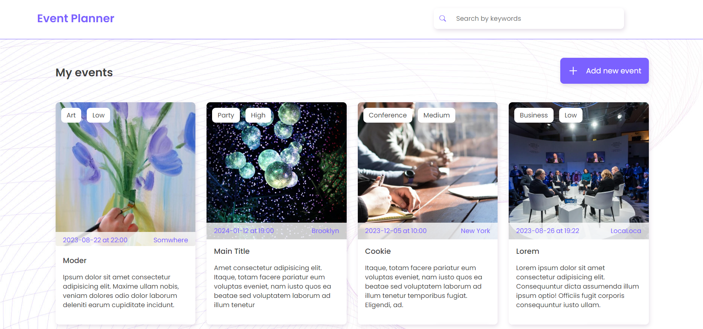

# Event Planner App

Welcome to the Event Planner repository! This is a [React + TypeScript + Vite](https://github.com/vitejs/vite-plugin-react/blob/main/packages/plugin-react/README.md) application designed to help you plan and manage your events efficiently. The app utilizes various features, including local storage for event persistence, a search bar for finding events by title, an edit event page, and adaptive layout for optimal user experience on different devices.



## Features

- **Local Storage:** The app leverages local storage to ensure your events are saved even after you close the browser. This means you can easily resume planning your events whenever you need to.

- **Search Functionality:** Searching for specific events has never been easier. The search bar allows you to filter events by their title, helping you quickly locate the events you're interested in.

- **Edit Event Page:** Need to make changes to an existing event? The edit event page lets you modify event details seamlessly. Whether it's updating the date, changing the description, or tweaking other attributes, you're in control.

- **Adaptive Layout:** The app's layout is designed to be adaptive, providing an optimal user experience across various screen sizes. Whether you're on a desktop, tablet, or smartphone, the app will adapt to your device's display.

## Libraries Used

- **React Hook Form:** This library simplifies form management in React applications, making it easier to handle form validation, submission, and data management.

- **Yup:** Yup is used for schema validation. It helps ensure that the data entered into the forms meets the specified criteria.

- **Notiflix:** Notiflix provides customizable notifications and dialogs, enhancing the user experience by providing feedback and alerts.

- **React Icons:** Include popular icons in your React projects easily with react-icons, which utilizes ES6 imports that allows you to include only the icons that your project is using.

- **Modern-Normilize:** For Normalize browsers' default style.

## Installation

1. Clone this repository to your local machine using:

   ```
   git clone https://github.com/kartavchenko/planner.git
   ```

2. Navigate to the project directory:

   ```
   cd planner
   ```

3. Install the required dependencies:

   ```
   npm install
   ```

4. Start the development server:

   ```
   npm run dev
   ```

5. Open your browser and navigate to `http://localhost:3000` to access the Planner app.

## How to Contribute

If you'd like to contribute to the Planner app, follow these steps:

1. Fork the repository.

2. Create a new branch for your feature/fix:

   ```
   git checkout -b feature/your-feature-name
   ```

3. Make your changes and commit them:

   ```
   git commit -m "Add your commit message here"
   ```

4. Push your changes to your forked repository:

   ```
   git push origin feature/your-feature-name
   ```

5. Create a pull request on the main repository, explaining your changes and their benefits.

## Feedback and Support

If you encounter any issues or have suggestions for improvement, please feel free to create an issue in the [Issue Tracker](https://github.com/kartavchenko/planner/issues).

We hope you find the Planner app helpful for your event management needs! Thank you for checking out our project.

---

_Note: Replace `your-username` with your actual GitHub username and make sure to include a screenshot of your app in the repository._
